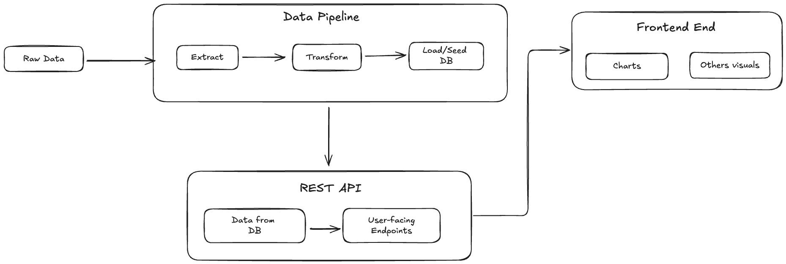
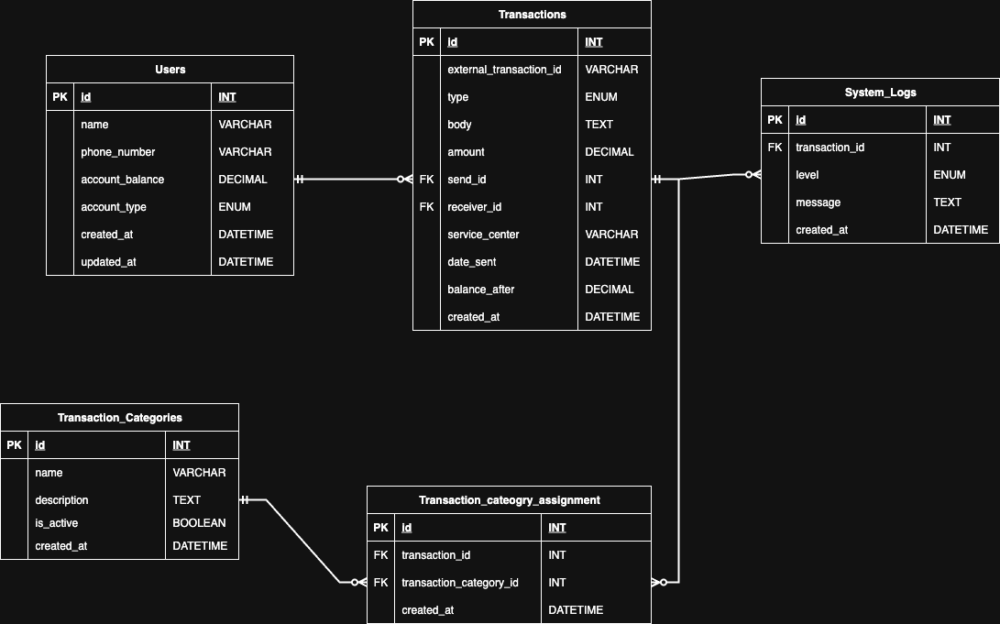

# Team Analyze

## 📋 Project Overview

**Team Analyze** is an enterprise-level fullstack application designed to process Mobile Money (MoMo) SMS transaction data. The system features:

- **Data Extraction:** Import and parse transaction data from XML files
- **Data Cleaning & Categorization:** Automatically clean and categorize transactions
- **Database Storage:** Store processed data in a secure relational database
- **Interactive Dashboard:** Analyze and visualize transactions through a modern web dashboard

## 👥 Team Members

- Victor Hamzat
- Dominion Yusuf
- Sarah Gasaro
- Mildred Ebomah

## 🗂️ Scrum Board

[GitHub Project Board](https://github.com/users/domyusuf/projects/1/views/1)

## 🖼️ System Architecture



## 🖼️ Entity Relationship Diagram


**Entity Separation Strategy**: The separation of Users, Transactions, and Transaction_Categories follows proper normalization principles, eliminating data redundancy while maintaining referential integrity. This design supports scalability as new transaction types can be added without modifying existing transaction records.

**Direct Relationship Model**:  The current design uses direct foreign keys (send_id, receiver_id) in the Transactions table, which is efficient for simple sender-receiver relationships and provides good query performance for most common use cases.

**Comprehensive Logging**: Including System_Logs with transaction_id foreign key enables detailed audit trails and troubleshooting capabilities, essential for financial data processing systems.

**Data Type Selections**: Using DECIMAL for monetary values (amount, account_balance, balance_after) prevents floating-point precision errors critical in financial applications. DATETIME fields support proper temporal queries and reporting.

## 🛠️ Setup

1. Clone the repository:

   ```bash
   git clone https://github.com/yourusername/team-analyze.git
   cd team-analyze
   ```

2. Create a virtual environment:

   ```bash
   python -m venv venv
   source venv/bin/activate  # On Windows use `venv\Scripts\activate`
   ```

3. Install the required packages:

   ```bash
   pip install -r requirements.txt
   ```

4. Start the API server:

   ```bash
   cd ./api && python api/app.py
   ```
