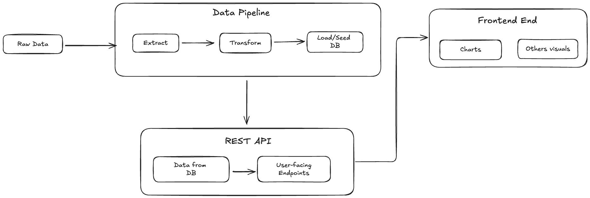

# Team Analyze

## 📋 Project Overview

**Team Analyze** is an enterprise-level fullstack application designed to process Mobile Money (MoMo) SMS transaction data. The system features:

- **Data Extraction:** Import and parse transaction data from XML files
- **Data Cleaning & Categorization:** Automatically clean and categorize transactions
- **Database Storage:** Store processed data in a secure relational database
- **Interactive Dashboard:** Analyze and visualize transactions through a modern web dashboard

## 👥 Team Members

- Victor Hamzat
- Dominion Yusuf
- Sarah Gasaro
- Mildred Ebomah

## 🗂️ Scrum Board

[GitHub Project Board](https://github.com/users/domyusuf/projects/1/views/1)

## 🖼️ System Architecture

